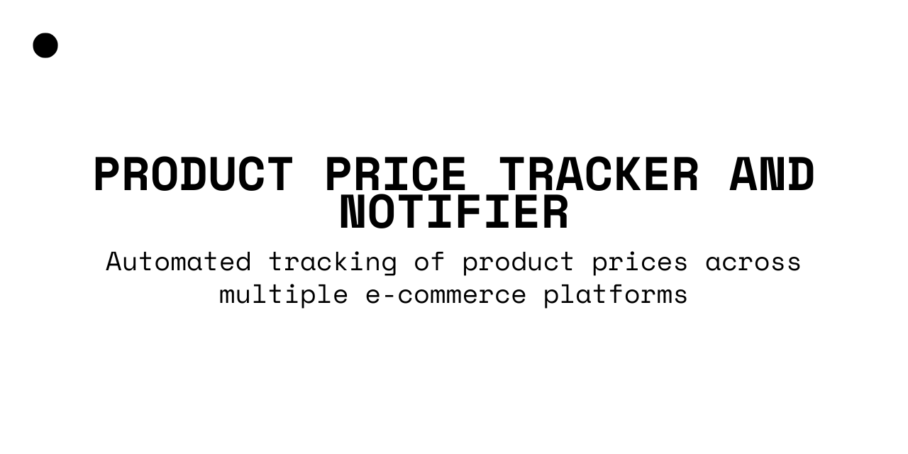

# Product Price Tracker and Notifier

This project automates the tracking of product prices across multiple e-commerce platforms (Idealo, Amazon, and eBay), stores the data in a SQLite database, generates visualizations, and sends email notifications when there are ranking changes. The system is deployed on AWS to run daily.

------------------------------------------------------------------------

## Features

-   **Automated Price Scraping**: Scrapes product prices from Idealo, Amazon, and eBay.

-   **Database Storage**: Saves scraped price data in a SQLite database.

-   **Visualization**: Generates a PDF with price trends and rankings.

-   **Email Notifications**: Sends alerts when product rankings change.

-   **AWS Deployment**: Runs automatically in the cloud using AWS services.

------------------------------------------------------------------------

## Prerequisites

### **Python Version**

-   Python 3.8 or higher

### **Dependencies**

Install required dependencies:

**Required libraries:**

-   pandas

-   sqlite3 (built-in with Python)

-   selenium

-   beautifulsoup4

-   matplotlib

-   seaborn

-   openpyxl

-   smtplib

### **Additional Requirements**

-   **ChromeDriver**: Ensure ChromeDriver is installed and its path is correctly set in `scraper.py`.

-   **Gmail Account**: Used for sending email notifications (configured in `emailSender.py`).

------------------------------------------------------------------------

## Project Structure

```         
project-directory/
│── main.py                  # Orchestrates the workflow
│── scraper.py               # Contains functions for web scraping
│── database.py              # Manages database initialization and storage
│── visualization.py         # Generates price comparison visualizations
│── emailSender.py           # Sends ranking change notifications
│── products.xlsx            # Input file containing product data and URLs
│── settings.txt             # Email recipients list
│── README.md                # Project documentation
```

------------------------------------------------------------------------

## Functionality

### **1. Database Initialization**

-   A SQLite database (`product_data.db`) is created with the following structure:

```         
CREATE TABLE IF NOT EXISTS PRICES (
    ID INTEGER PRIMARY KEY AUTOINCREMENT,
    Product TEXT NOT NULL,
    Seller TEXT NOT NULL,
    Date TEXT NOT NULL,
    Price REAL NOT NULL,
    UNIQUE(Product, Seller, Date)
);
```

### **2. Data Input (products.xlsx)**

The Excel file contains:

-   `Product name`: Standardized product name.

-   `Idealo URL`: Product page on Idealo.

-   `Amazon URL`: Product page on Amazon.

-   `eBay URL`: Product page on eBay.

-   `G7 Price`: Your company's price for the product.

#### Important Note on URLs

E-commerce product page URLs may change over time due to:
- product page updates
- regional redirects
- changes in marketplace structure
- expired or unavailable products

If scraping fails or returns missing data, verify that the URLs in `products.xlsx` are still valid and update them accordingly.

### **3. Web Scraping**

-   **Idealo Scraper (`scrape_idealo`)**: Extracts product name, seller names, and prices.

-   **Amazon Scraper (`scrape_amazon`)**: Extracts product name and price.

-   **eBay Scraper (`scrape_ebay`)**: Extracts product name and price.

-   The scraped data is stored in `product_data.db`.

### **4. Visualization**

-   Generates a PDF with price comparisons.

-   Shows trends over time for each product.

### **5. Email Notification**

-   Detects changes in ranking and sends an email report.

-   Reads recipient emails from `settings.txt`.

------------------------------------------------------------------------

## Running the Project

### **Local Execution**

1.  **Install dependencies**:

    ```         
    pip install 
    ```

2.  **Run the main script**:

    ```         
    python main.py
    ```

------------------------------------------------------------------------

## Output

-   **Database**: `product_data.db` stores all scraped price data.

-   **Visualization**: A PDF (e.g., `YYYY-MM-DD_prices_visualizations.pdf`) with price trends and rankings.

-   **Email Notifications**: Alerts sent when rankings change.

------------------------------------------------------------------------

## Troubleshooting

### **Common Issues & Fixes**

-   **ChromeDriver Errors**: Ensure ChromeDriver version matches your Chrome browser.

-   **Invalid URLs**: Check if URLs in `products.xlsx` are correct and working.

------------------------------------------------------------------------

## Authors

-   Arpit Botham
-   Malik Asim Aziz
-   Maria Jose Ayala
-   Andres Cadena

